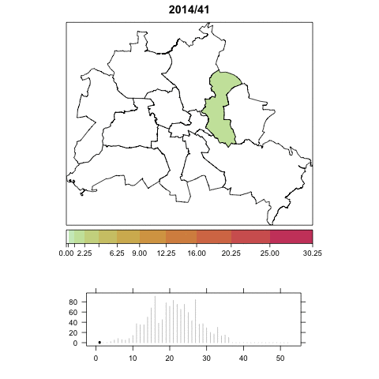

# MeaslesBerlin

R code mimicking the analysis performed in
[Wie-sich-die-Masern-in-Berlin-ausbreiten.html](http://www.morgenpost.de/berlin/article137810495/Wie-sich-die-Masern-in-Berlin-ausbreiten.html)
using the R package
[surveillance](https://surveillance.r-forge.r-project.org).
[SurvStat@RKI](https://survstat.rki.de/) data on the large 2015 measles outbreak in the districts of Berlin is visualized.

See the [visualize-measles.html](visualize-measles.html) file or its
markdown version for the code. The file [index.html](index.html) contains an
animation, whereas animated GIFs can also be directly produced:

The manuscript [*Spatio-Temporal Analysis of Epidemic Phenomena Using
the R Package surveillance*](http://arxiv.org/abs/1411.0416) to appear
in the Journal of Statistical Software contains further details.
